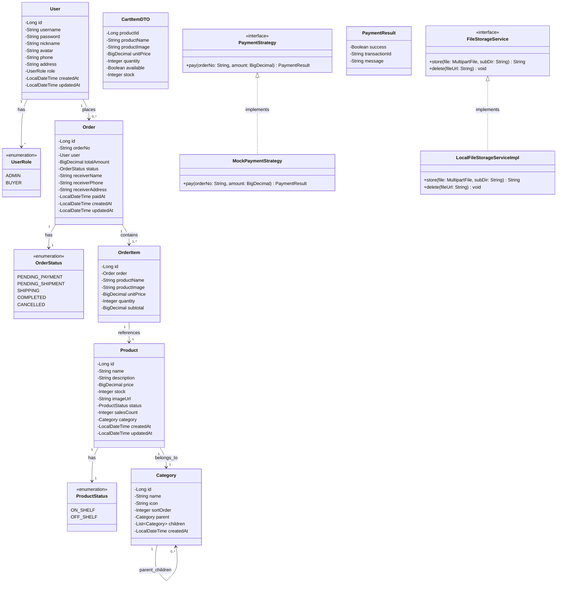
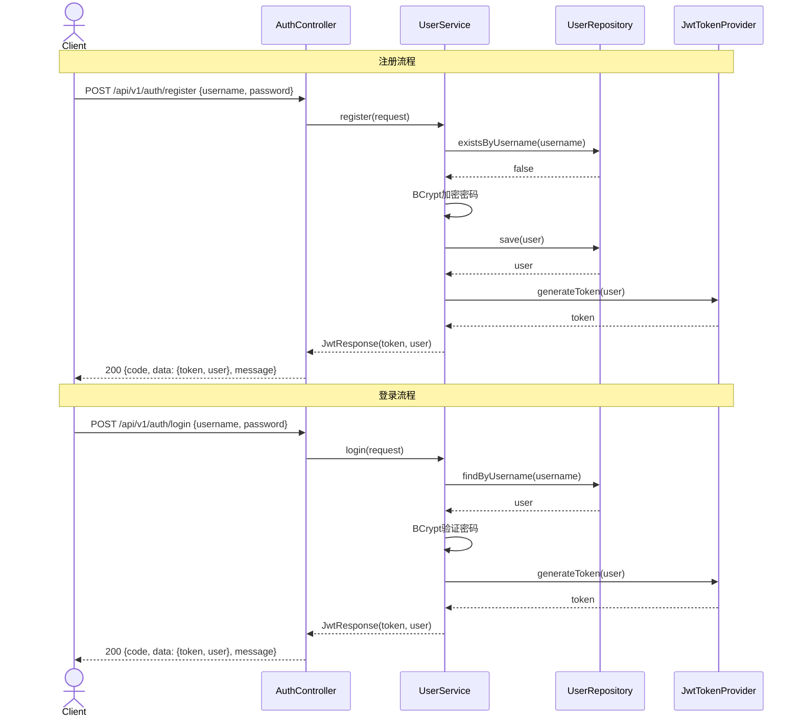
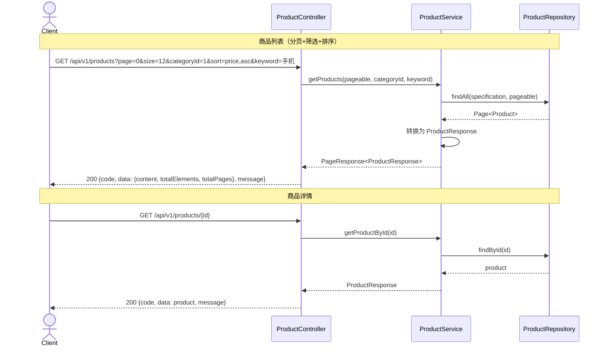
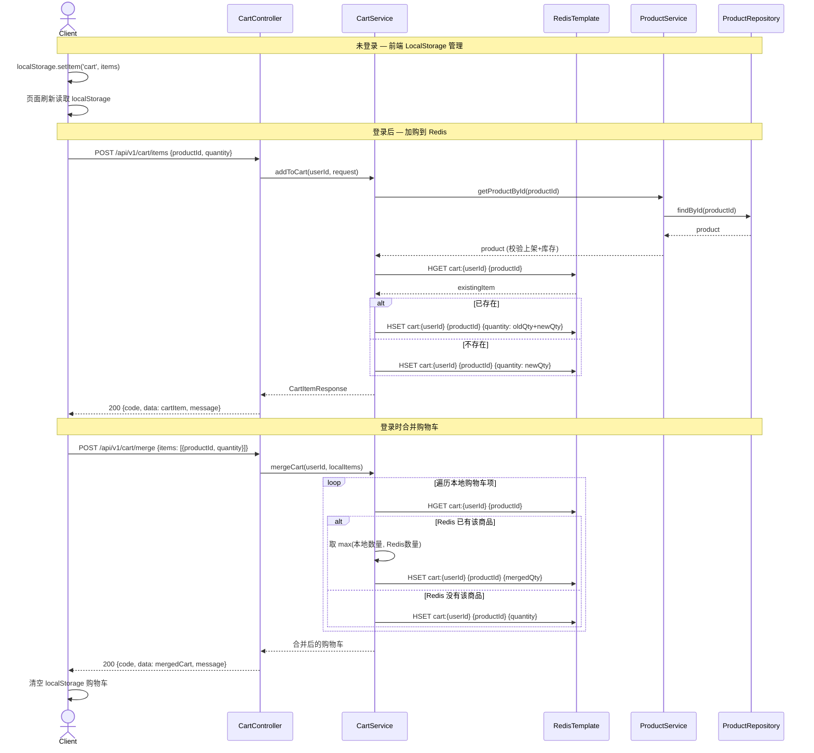
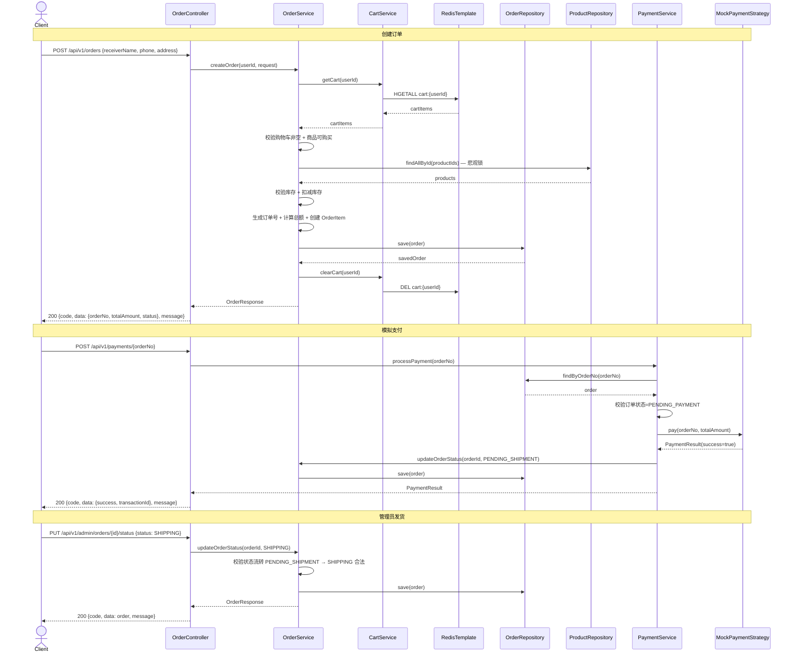
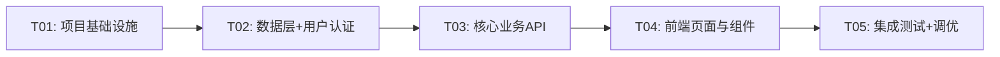

# Headless 电子商务系统 — 系统架构设计

## 1. 实现方案与框架选型

### 1.1 核心技术挑战

| 挑战 | 解决方案 |
|------|----------|
| 前后端完全解耦 | RESTful API + JWT 无状态认证，前后端独立部署 |
| 未登录购物车与登录购物车合并 | 前端 LocalStorage + 后端 Redis 双层存储，登录时按策略合并 |
| 订单状态机严格控制 | 状态机模式（Enum + 校验），只允许合法状态流转 |
| 订单超时自动取消 | Spring @Scheduled 定时任务扫描超时订单 |
| 库存扣减一致性 | 下单时悲观锁扣减，取消/超时时回滚 |
| 支付接口可扩展 | Strategy 模式，MockPayment 实现默认策略，预留真实支付接口 |
| 图片存储可扩展 | 本地文件系统 + StorageService 接口抽象，后续可替换为 OSS/S3 |

### 1.2 框架选型

#### 后端

| 框架/库 | 版本 | 用途 | 选型理由 |
|---------|------|------|----------|
| Spring Boot | 3.3.x | 应用框架 | 生态成熟、自动配置、社区活跃 |
| Spring Security | 6.3.x | 认证授权 | 与 Spring Boot 深度集成，JWT 集成方便 |
| Spring Data JPA | 3.3.x | ORM 持久层 | 减少样板代码， Specification 动态查询 |
| MySQL | 8.0.x | 关系型数据库 | 事务支持好，电商场景成熟 |
| Redis | 7.x | 缓存/购物车 | 高性能 KV 存储，适合购物车场景 |
| jjwt | 0.12.x | JWT 令牌 | Java JWT 标准库 |
| Lombok | 1.18.x | 代码简化 | 减少样板代码 |
| MapStruct | 1.5.x | 对象映射 | Entity ↔ DTO 转换，编译期生成 |
| Springdoc OpenAPI | 2.6.x | API 文档 | 自动生成 Swagger UI |
| Flyway | 10.x | 数据库迁移 | 版本化 Schema 管理 |

#### 前端

| 框架/库 | 版本 | 用途 | 选型理由 |
|---------|------|------|----------|
| Next.js | 15.x | React 框架 | App Router + SSR/SSG，路由内置 |
| React | 19.x | UI 库 | 生态最大 |
| TypeScript | 5.x | 类型系统 | 编译期类型安全 |
| Zustand | 5.x | 状态管理 | 轻量、API 简洁、适合中小项目 |
| TanStack Query | 5.x | 服务端状态 | 请求缓存、自动重试、分页支持 |
| Tailwind CSS | 4.x | 原子化 CSS | 高效开发、一致性样式 |
| Shadcn UI | latest | 组件库 | 可定制、基于 Radix UI、复制式使用 |
| Axios | 1.7.x | HTTP 客户端 | 拦截器、请求/响应统一处理 |
| React Hook Form | 7.x | 表单管理 | 性能好、验证灵活 |
| Zod | 3.x | Schema 验证 | 与 React Hook Form 配合，类型推导 |
| Lucide React | latest | 图标库 | 轻量、风格统一 |

### 1.3 架构模式

- **后端**：分层架构（Controller → Service → Repository）+ DTO 隔离
- **前端**：App Router 文件路由 + Zustand 全局状态 + TanStack Query 服务端状态 + 自定义 Hook 封装

---

## 2. 文件列表及相对路径

### 2.1 后端项目结构（`backend/`）

```
backend/
├── pom.xml
├── src/
│   ├── main/
│   │   ├── java/com/headless/ecommerce/
│   │   │   ├── EcommerceApplication.java
│   │   │   ├── config/
│   │   │   │   ├── SecurityConfig.java
│   │   │   │   ├── RedisConfig.java
│   │   │   │   ├── CorsConfig.java
│   │   │   │   ├── OpenApiConfig.java
│   │   │   │   └── WebMvcConfig.java
│   │   │   ├── security/
│   │   │   │   ├── JwtTokenProvider.java
│   │   │   │   ├── JwtAuthenticationFilter.java
│   │   │   │   └── CustomUserDetailsService.java
│   │   │   ├── model/
│   │   │   │   ├── User.java
│   │   │   │   ├── Product.java
│   │   │   │   ├── Category.java
│   │   │   │   ├── Order.java
│   │   │   │   ├── OrderItem.java
│   │   │   │   └── enums/
│   │   │   │       ├── UserRole.java
│   │   │   │       ├── OrderStatus.java
│   │   │   │       └── ProductStatus.java
│   │   │   ├── dto/
│   │   │   │   ├── request/
│   │   │   │   │   ├── RegisterRequest.java
│   │   │   │   │   ├── LoginRequest.java
│   │   │   │   │   ├── ProductCreateRequest.java
│   │   │   │   │   ├── ProductUpdateRequest.java
│   │   │   │   │   ├── CategoryCreateRequest.java
│   │   │   │   │   ├── CartItemRequest.java
│   │   │   │   │   ├── OrderCreateRequest.java
│   │   │   │   │   └── OrderStatusUpdateRequest.java
│   │   │   │   └── response/
│   │   │   │       ├── ApiResponse.java
│   │   │   │       ├── JwtResponse.java
│   │   │   │       ├── UserResponse.java
│   │   │   │       ├── ProductResponse.java
│   │   │   │       ├── CategoryResponse.java
│   │   │   │       ├── CartItemResponse.java
│   │   │   │       ├── OrderResponse.java
│   │   │   │       ├── OrderItemResponse.java
│   │   │   │       └── PageResponse.java
│   │   │   ├── repository/
│   │   │   │   ├── UserRepository.java
│   │   │   │   ├── ProductRepository.java
│   │   │   │   ├── CategoryRepository.java
│   │   │   │   └── OrderRepository.java
│   │   │   ├── service/
│   │   │   │   ├── UserService.java
│   │   │   │   ├── ProductService.java
│   │   │   │   ├── CategoryService.java
│   │   │   │   ├── CartService.java
│   │   │   │   ├── OrderService.java
│   │   │   │   ├── PaymentService.java
│   │   │   │   └── FileStorageService.java
│   │   │   ├── service/impl/
│   │   │   │   ├── UserServiceImpl.java
│   │   │   │   ├── ProductServiceImpl.java
│   │   │   │   ├── CategoryServiceImpl.java
│   │   │   │   ├── CartServiceImpl.java
│   │   │   │   ├── OrderServiceImpl.java
│   │   │   │   ├── PaymentServiceImpl.java
│   │   │   │   ├── MockPaymentStrategy.java
│   │   │   │   └── LocalFileStorageServiceImpl.java
│   │   │   ├── service/strategy/
│   │   │   │   └── PaymentStrategy.java
│   │   │   ├── controller/
│   │   │   │   ├── AuthController.java
│   │   │   │   ├── UserController.java
│   │   │   │   ├── ProductController.java
│   │   │   │   ├── CategoryController.java
│   │   │   │   ├── CartController.java
│   │   │   │   ├── OrderController.java
│   │   │   │   ├── PaymentController.java
│   │   │   │   └── AdminController.java
│   │   │   ├── exception/
│   │   │   │   ├── BusinessException.java
│   │   │   │   ├── ResourceNotFoundException.java
│   │   │   │   ├── UnauthorizedException.java
│   │   │   │   └── GlobalExceptionHandler.java
│   │   │   ├── scheduler/
│   │   │   │   └── OrderTimeoutScheduler.java
│   │   │   └── mapper/
│   │   │       ├── UserMapper.java
│   │   │       ├── ProductMapper.java
│   │   │       ├── CategoryMapper.java
│   │   │       ├── OrderMapper.java
│   │   │       └── CartMapper.java
│   │   └── resources/
│   │       ├── application.yml
│   │       ├── application-dev.yml
│   │       ├── application-prod.yml
│   │       └── db/migration/
│   │           ├── V1__create_user_table.sql
│   │           ├── V2__create_category_table.sql
│   │           ├── V3__create_product_table.sql
│   │           ├── V4__create_order_tables.sql
│   │           └── V5__insert_seed_data.sql
│   └── test/
│       └── java/com/headless/ecommerce/
│           ├── service/
│           │   ├── UserServiceTest.java
│           │   ├── ProductServiceTest.java
│           │   ├── CartServiceTest.java
│           │   └── OrderServiceTest.java
│           └── controller/
│               ├── AuthControllerTest.java
│               └── ProductControllerTest.java
├── Dockerfile
└── uploads/                           # 本地图片上传目录
    └── .gitkeep
```

### 2.2 前端项目结构（`frontend/`）

```
frontend/
├── package.json
├── next.config.ts
├── tsconfig.json
├── tailwind.config.ts
├── postcss.config.mjs
├── components.json                     # Shadcn UI 配置
├── .env.local
├── public/
│   ├── images/
│   │   ├── placeholder-product.png
│   │   └── logo.svg
│   └── favicon.ico
├── src/
│   ├── app/
│   │   ├── layout.tsx                  # RootLayout
│   │   ├── page.tsx                    # 首页
│   │   ├── globals.css                 # 全局样式 + Tailwind
│   │   ├── (shop)/
│   │   │   ├── layout.tsx              # 商城布局（Header + Footer）
│   │   │   ├── products/
│   │   │   │   ├── page.tsx            # 商品列表页
│   │   │   │   └── [id]/
│   │   │   │       └── page.tsx        # 商品详情页
│   │   │   ├── cart/
│   │   │   │   └── page.tsx            # 购物车页
│   │   │   ├── checkout/
│   │   │   │   └── page.tsx            # 结算页
│   │   │   └── orders/
│   │   │       ├── page.tsx            # 订单列表页
│   │   │       └── [id]/
│   │   │           └── page.tsx        # 订单详情页
│   │   ├── auth/
│   │   │   ├── login/
│   │   │   │   └── page.tsx            # 登录页
│   │   │   └── register/
│   │   │       └── page.tsx            # 注册页
│   │   ├── user/
│   │   │   └── page.tsx                # 用户中心
│   │   └── admin/
│   │       ├── layout.tsx              # 管理后台布局
│   │       ├── page.tsx                # 仪表盘
│   │       ├── products/
│   │       │   ├── page.tsx            # 商品管理列表
│   │       │   ├── new/
│   │       │   │   └── page.tsx        # 新增商品
│   │       │   └── [id]/
│   │       │       └── edit/
│   │       │           └── page.tsx    # 编辑商品
│   │       ├── categories/
│   │       │   └── page.tsx            # 分类管理
│   │       └── orders/
│   │           ├── page.tsx            # 订单管理列表
│   │           └── [id]/
│   │               └── page.tsx        # 订单详情（管理）
│   ├── components/
│   │   ├── ui/                         # Shadcn UI 组件
│   │   │   ├── button.tsx
│   │   │   ├── input.tsx
│   │   │   ├── card.tsx
│   │   │   ├── dialog.tsx
│   │   │   ├── dropdown-menu.tsx
│   │   │   ├── table.tsx
│   │   │   ├── badge.tsx
│   │   │   ├── select.tsx
│   │   │   ├── toast.tsx
│   │   │   ├── skeleton.tsx
│   │   │   ├── pagination.tsx
│   │   │   ├── tabs.tsx
│   │   │   ├── form.tsx
│   │   │   ├── label.tsx
│   │   │   ├── separator.tsx
│   │   │   ├── sheet.tsx
│   │   │   ├── avatar.tsx
│   │   │   ├── textarea.tsx
│   │   │   └── alert.tsx
│   │   ├── layout/
│   │   │   ├── Header.tsx              # 前台顶部导航
│   │   │   ├── Footer.tsx              # 前台底部
│   │   │   ├── AdminSidebar.tsx        # 管理后台侧边栏
│   │   │   └── AdminHeader.tsx         # 管理后台顶部
│   │   ├── product/
│   │   │   ├── ProductCard.tsx         # 商品卡片
│   │   │   ├── ProductGrid.tsx         # 商品网格
│   │   │   ├── ProductFilters.tsx      # 筛选/排序
│   │   │   └── ProductImageGallery.tsx # 商品图片轮播
│   │   ├── cart/
│   │   │   ├── CartItemRow.tsx         # 购物车商品行
│   │   │   ├── CartSummary.tsx         # 购物车汇总
│   │   │   └── CartIcon.tsx            # 顶部购物车图标+角标
│   │   ├── order/
│   │   │   ├── OrderStatusBadge.tsx    # 订单状态标签
│   │   │   ├── OrderItemList.tsx       # 订单商品列表
│   │   │   └── OrderTimeline.tsx       # 订单状态时间线
│   │   ├── auth/
│   │   │   ├── LoginForm.tsx           # 登录表单
│   │   │   └── RegisterForm.tsx        # 注册表单
│   │   └── common/
│   │       ├── Pagination.tsx          # 分页组件
│   │       ├── LoadingSpinner.tsx      # 加载状态
│   │       ├── EmptyState.tsx          # 空状态
│   │       ├── ImageUpload.tsx         # 图片上传
│   │       └── ConfirmDialog.tsx       # 确认对话框
│   ├── lib/
│   │   ├── api.ts                      # Axios 实例 + 拦截器
│   │   ├── utils.ts                    # 工具函数（cn 等）
│   │   └── constants.ts               # 常量定义
│   ├── hooks/
│   │   ├── useAuth.ts                  # 认证 Hook
│   │   ├── useCart.ts                  # 购物车 Hook
│   │   ├── useProducts.ts             # 商品查询 Hook
│   │   └── useOrders.ts              # 订单查询 Hook
│   ├── stores/
│   │   ├── auth-store.ts              # 认证状态（Zustand）
│   │   └── cart-store.ts             # 购物车状态（Zustand）
│   ├── services/
│   │   ├── auth-service.ts            # 认证 API
│   │   ├── product-service.ts         # 商品 API
│   │   ├── category-service.ts        # 分类 API
│   │   ├── cart-service.ts            # 购物车 API
│   │   ├── order-service.ts           # 订单 API
│   │   └── payment-service.ts         # 支付 API
│   └── types/
│       ├── api.ts                      # API 通用类型
│       ├── user.ts                     # 用户类型
│       ├── product.ts                  # 商品类型
│       ├── category.ts                 # 分类类型
│       ├── cart.ts                     # 购物车类型
│       └── order.ts                    # 订单类型
├── Dockerfile
└── .dockerignore
```

### 2.3 项目根目录

```
2026-05-19-task-17/
├── docs/
│   ├── prd.md
│   ├── architecture.md
│   ├── class-diagram.mermaid
│   └── sequence-diagram.mermaid
├── backend/
│   └── ... (见上方)
├── frontend/
│   └── ... (见上方)
├── docker-compose.yml
├── .gitignore
└── README.md
```

---

## 3. 数据结构与接口（类图）



### 3.1 核心实体字段说明

#### User（用户表 `t_user`）

| 字段 | 类型 | 说明 |
|------|------|------|
| id | BIGINT | 主键，自增 |
| username | VARCHAR(50) | 用户名，唯一 |
| password | VARCHAR(100) | BCrypt 加密 |
| nickname | VARCHAR(50) | 昵称 |
| avatar | VARCHAR(255) | 头像 URL |
| phone | VARCHAR(20) | 手机号 |
| address | VARCHAR(255) | 默认收货地址 |
| role | ENUM('ADMIN','BUYER') | 角色 |
| created_at | DATETIME | 创建时间 |
| updated_at | DATETIME | 更新时间 |

#### Product（商品表 `t_product`）

| 字段 | 类型 | 说明 |
|------|------|------|
| id | BIGINT | 主键，自增 |
| name | VARCHAR(200) | 商品名称 |
| description | TEXT | 商品描述 |
| price | DECIMAL(10,2) | 价格 |
| stock | INT | 库存 |
| image_url | VARCHAR(255) | 主图 URL |
| status | ENUM('ON_SHELF','OFF_SHELF') | 上下架状态 |
| sales_count | INT | 销量，默认 0 |
| category_id | BIGINT | 分类外键 |
| created_at | DATETIME | 创建时间 |
| updated_at | DATETIME | 更新时间 |

#### Category（分类表 `t_category`）

| 字段 | 类型 | 说明 |
|------|------|------|
| id | BIGINT | 主键，自增 |
| name | VARCHAR(50) | 分类名 |
| icon | VARCHAR(255) | 图标 |
| sort_order | INT | 排序号 |
| parent_id | BIGINT | 父分类 ID（自引用） |
| created_at | DATETIME | 创建时间 |

#### Order（订单表 `t_order`）

| 字段 | 类型 | 说明 |
|------|------|------|
| id | BIGINT | 主键，自增 |
| order_no | VARCHAR(32) | 订单号，唯一索引 |
| user_id | BIGINT | 用户外键 |
| total_amount | DECIMAL(10,2) | 订单总额 |
| status | ENUM | 订单状态 |
| receiver_name | VARCHAR(50) | 收货人 |
| receiver_phone | VARCHAR(20) | 收货电话 |
| receiver_address | VARCHAR(255) | 收货地址 |
| paid_at | DATETIME | 支付时间 |
| created_at | DATETIME | 创建时间 |
| updated_at | DATETIME | 更新时间 |

#### OrderItem（订单项表 `t_order_item`）

| 字段 | 类型 | 说明 |
|------|------|------|
| id | BIGINT | 主键，自增 |
| order_id | BIGINT | 订单外键 |
| product_name | VARCHAR(200) | 商品名称（快照） |
| product_image | VARCHAR(255) | 商品图片（快照） |
| unit_price | DECIMAL(10,2) | 下单时单价（快照） |
| quantity | INT | 数量 |
| subtotal | DECIMAL(10,2) | 小计 |

### 3.2 购物车数据结构（Redis）

购物车不建数据库表，使用 Redis Hash 存储：

- **Key**: `cart:{userId}`
- **Field**: `productId`
- **Value**: JSON `{"productId":1,"quantity":3}`
- 读取时关联 Product 表补充名称、价格、库存、状态

### 3.3 核心 API 接口一览

| 模块 | 方法 | 路径 | 说明 | 认证 |
|------|------|------|------|------|
| Auth | POST | /api/v1/auth/register | 注册 | 无 |
| Auth | POST | /api/v1/auth/login | 登录 | 无 |
| User | GET | /api/v1/users/me | 当前用户信息 | BUYER/ADMIN |
| User | PUT | /api/v1/users/me | 更新用户信息 | BUYER/ADMIN |
| Product | GET | /api/v1/products | 商品列表（分页） | 无 |
| Product | GET | /api/v1/products/{id} | 商品详情 | 无 |
| Product | GET | /api/v1/products/search | 商品搜索 | 无 |
| Category | GET | /api/v1/categories | 分类树 | 无 |
| Cart | GET | /api/v1/cart | 获取购物车 | BUYER |
| Cart | POST | /api/v1/cart/items | 添加购物车项 | BUYER |
| Cart | PUT | /api/v1/cart/items/{productId} | 修改数量 | BUYER |
| Cart | DELETE | /api/v1/cart/items/{productId} | 删除购物车项 | BUYER |
| Cart | POST | /api/v1/cart/merge | 登录合并购物车 | BUYER |
| Order | POST | /api/v1/orders | 创建订单 | BUYER |
| Order | GET | /api/v1/orders | 我的订单列表 | BUYER |
| Order | GET | /api/v1/orders/{id} | 订单详情 | BUYER |
| Order | PUT | /api/v1/orders/{id}/cancel | 取消订单 | BUYER |
| Payment | POST | /api/v1/payments/{orderNo} | 模拟支付 | BUYER |
| Admin-Product | POST | /api/v1/admin/products | 新增商品 | ADMIN |
| Admin-Product | PUT | /api/v1/admin/products/{id} | 编辑商品 | ADMIN |
| Admin-Product | DELETE | /api/v1/admin/products/{id} | 删除商品 | ADMIN |
| Admin-Product | PUT | /api/v1/admin/products/{id}/status | 上下架 | ADMIN |
| Admin-Category | POST | /api/v1/admin/categories | 新增分类 | ADMIN |
| Admin-Category | PUT | /api/v1/admin/categories/{id} | 编辑分类 | ADMIN |
| Admin-Category | DELETE | /api/v1/admin/categories/{id} | 删除分类 | ADMIN |
| Admin-Order | GET | /api/v1/admin/orders | 所有订单列表 | ADMIN |
| Admin-Order | PUT | /api/v1/admin/orders/{id}/status | 修改订单状态 | ADMIN |
| Admin-Upload | POST | /api/v1/admin/upload | 图片上传 | ADMIN |
| Admin-Dashboard | GET | /api/v1/admin/dashboard | 仪表盘数据 | ADMIN |

---

## 4. 程序调用流程（时序图）

### 4.1 用户注册/登录



### 4.2 商品浏览与搜索



### 4.3 购物车操作（加购 / 登录合并）



### 4.4 下单支付流程



---

## 5. 任务列表

### T01：项目基础设施（后端脚手架 + 前端脚手架 + Docker + 数据库迁移）

**涉及文件**：
- `backend/pom.xml`
- `backend/src/main/java/com/headless/ecommerce/EcommerceApplication.java`
- `backend/src/main/java/com/headless/ecommerce/config/SecurityConfig.java`
- `backend/src/main/java/com/headless/ecommerce/config/RedisConfig.java`
- `backend/src/main/java/com/headless/ecommerce/config/CorsConfig.java`
- `backend/src/main/java/com/headless/ecommerce/config/OpenApiConfig.java`
- `backend/src/main/java/com/headless/ecommerce/config/WebMvcConfig.java`
- `backend/src/main/java/com/headless/ecommerce/security/JwtTokenProvider.java`
- `backend/src/main/java/com/headless/ecommerce/security/JwtAuthenticationFilter.java`
- `backend/src/main/java/com/headless/ecommerce/security/CustomUserDetailsService.java`
- `backend/src/main/java/com/headless/ecommerce/exception/BusinessException.java`
- `backend/src/main/java/com/headless/ecommerce/exception/ResourceNotFoundException.java`
- `backend/src/main/java/com/headless/ecommerce/exception/UnauthorizedException.java`
- `backend/src/main/java/com/headless/ecommerce/exception/GlobalExceptionHandler.java`
- `backend/src/main/java/com/headless/ecommerce/dto/response/ApiResponse.java`
- `backend/src/main/java/com/headless/ecommerce/dto/response/PageResponse.java`
- `backend/src/main/java/com/headless/ecommerce/dto/response/JwtResponse.java`
- `backend/src/main/resources/application.yml`
- `backend/src/main/resources/application-dev.yml`
- `backend/src/main/resources/application-prod.yml`
- `backend/src/main/resources/db/migration/V1__create_user_table.sql`
- `backend/src/main/resources/db/migration/V2__create_category_table.sql`
- `backend/src/main/resources/db/migration/V3__create_product_table.sql`
- `backend/src/main/resources/db/migration/V4__create_order_tables.sql`
- `backend/src/main/resources/db/migration/V5__insert_seed_data.sql`
- `backend/Dockerfile`
- `backend/uploads/.gitkeep`
- `frontend/package.json`
- `frontend/next.config.ts`
- `frontend/tsconfig.json`
- `frontend/tailwind.config.ts`
- `frontend/postcss.config.mjs`
- `frontend/components.json`
- `frontend/.env.local`
- `frontend/src/app/layout.tsx`
- `frontend/src/app/page.tsx`
- `frontend/src/app/globals.css`
- `frontend/src/lib/api.ts`
- `frontend/src/lib/utils.ts`
- `frontend/src/lib/constants.ts`
- `frontend/src/types/api.ts`
- `frontend/public/images/placeholder-product.png`
- `frontend/public/images/logo.svg`
- `frontend/public/favicon.ico`
- `frontend/Dockerfile`
- `frontend/.dockerignore`
- `docker-compose.yml`
- `.gitignore`

**依赖**：无
**优先级**：P0

---

### T02：数据层 + 用户与认证模块

**涉及文件**：
- `backend/src/main/java/com/headless/ecommerce/model/User.java`
- `backend/src/main/java/com/headless/ecommerce/model/Product.java`
- `backend/src/main/java/com/headless/ecommerce/model/Category.java`
- `backend/src/main/java/com/headless/ecommerce/model/Order.java`
- `backend/src/main/java/com/headless/ecommerce/model/OrderItem.java`
- `backend/src/main/java/com/headless/ecommerce/model/enums/UserRole.java`
- `backend/src/main/java/com/headless/ecommerce/model/enums/OrderStatus.java`
- `backend/src/main/java/com/headless/ecommerce/model/enums/ProductStatus.java`
- `backend/src/main/java/com/headless/ecommerce/repository/UserRepository.java`
- `backend/src/main/java/com/headless/ecommerce/repository/ProductRepository.java`
- `backend/src/main/java/com/headless/ecommerce/repository/CategoryRepository.java`
- `backend/src/main/java/com/headless/ecommerce/repository/OrderRepository.java`
- `backend/src/main/java/com/headless/ecommerce/dto/request/RegisterRequest.java`
- `backend/src/main/java/com/headless/ecommerce/dto/request/LoginRequest.java`
- `backend/src/main/java/com/headless/ecommerce/dto/request/ProductCreateRequest.java`
- `backend/src/main/java/com/headless/ecommerce/dto/request/ProductUpdateRequest.java`
- `backend/src/main/java/com/headless/ecommerce/dto/request/CategoryCreateRequest.java`
- `backend/src/main/java/com/headless/ecommerce/dto/request/CartItemRequest.java`
- `backend/src/main/java/com/headless/ecommerce/dto/request/OrderCreateRequest.java`
- `backend/src/main/java/com/headless/ecommerce/dto/request/OrderStatusUpdateRequest.java`
- `backend/src/main/java/com/headless/ecommerce/dto/response/UserResponse.java`
- `backend/src/main/java/com/headless/ecommerce/dto/response/ProductResponse.java`
- `backend/src/main/java/com/headless/ecommerce/dto/response/CategoryResponse.java`
- `backend/src/main/java/com/headless/ecommerce/dto/response/CartItemResponse.java`
- `backend/src/main/java/com/headless/ecommerce/dto/response/OrderResponse.java`
- `backend/src/main/java/com/headless/ecommerce/dto/response/OrderItemResponse.java`
- `backend/src/main/java/com/headless/ecommerce/mapper/UserMapper.java`
- `backend/src/main/java/com/headless/ecommerce/mapper/ProductMapper.java`
- `backend/src/main/java/com/headless/ecommerce/mapper/CategoryMapper.java`
- `backend/src/main/java/com/headless/ecommerce/mapper/OrderMapper.java`
- `backend/src/main/java/com/headless/ecommerce/mapper/CartMapper.java`
- `backend/src/main/java/com/headless/ecommerce/controller/AuthController.java`
- `backend/src/main/java/com/headless/ecommerce/controller/UserController.java`
- `backend/src/main/java/com/headless/ecommerce/service/UserService.java`
- `backend/src/main/java/com/headless/ecommerce/service/impl/UserServiceImpl.java`
- `frontend/src/types/user.ts`
- `frontend/src/types/product.ts`
- `frontend/src/types/category.ts`
- `frontend/src/types/cart.ts`
- `frontend/src/types/order.ts`
- `frontend/src/stores/auth-store.ts`
- `frontend/src/stores/cart-store.ts`
- `frontend/src/services/auth-service.ts`
- `frontend/src/hooks/useAuth.ts`
- `frontend/src/hooks/useCart.ts`
- `frontend/src/app/auth/login/page.tsx`
- `frontend/src/app/auth/register/page.tsx`
- `frontend/src/components/auth/LoginForm.tsx`
- `frontend/src/components/auth/RegisterForm.tsx`

**依赖**：T01
**优先级**：P0

---

### T03：核心业务 API（商品 + 购物车 + 订单 + 支付 + 管理后台）

**涉及文件**：
- `backend/src/main/java/com/headless/ecommerce/service/ProductService.java`
- `backend/src/main/java/com/headless/ecommerce/service/CategoryService.java`
- `backend/src/main/java/com/headless/ecommerce/service/CartService.java`
- `backend/src/main/java/com/headless/ecommerce/service/OrderService.java`
- `backend/src/main/java/com/headless/ecommerce/service/PaymentService.java`
- `backend/src/main/java/com/headless/ecommerce/service/FileStorageService.java`
- `backend/src/main/java/com/headless/ecommerce/service/strategy/PaymentStrategy.java`
- `backend/src/main/java/com/headless/ecommerce/service/impl/ProductServiceImpl.java`
- `backend/src/main/java/com/headless/ecommerce/service/impl/CategoryServiceImpl.java`
- `backend/src/main/java/com/headless/ecommerce/service/impl/CartServiceImpl.java`
- `backend/src/main/java/com/headless/ecommerce/service/impl/OrderServiceImpl.java`
- `backend/src/main/java/com/headless/ecommerce/service/impl/PaymentServiceImpl.java`
- `backend/src/main/java/com/headless/ecommerce/service/impl/MockPaymentStrategy.java`
- `backend/src/main/java/com/headless/ecommerce/service/impl/LocalFileStorageServiceImpl.java`
- `backend/src/main/java/com/headless/ecommerce/scheduler/OrderTimeoutScheduler.java`
- `backend/src/main/java/com/headless/ecommerce/controller/ProductController.java`
- `backend/src/main/java/com/headless/ecommerce/controller/CategoryController.java`
- `backend/src/main/java/com/headless/ecommerce/controller/CartController.java`
- `backend/src/main/java/com/headless/ecommerce/controller/OrderController.java`
- `backend/src/main/java/com/headless/ecommerce/controller/PaymentController.java`
- `backend/src/main/java/com/headless/ecommerce/controller/AdminController.java`
- `frontend/src/services/product-service.ts`
- `frontend/src/services/category-service.ts`
- `frontend/src/services/cart-service.ts`
- `frontend/src/services/order-service.ts`
- `frontend/src/services/payment-service.ts`
- `frontend/src/hooks/useProducts.ts`
- `frontend/src/hooks/useOrders.ts`

**依赖**：T02
**优先级**：P0

---

### T04：前端页面与组件（前台商城 + 管理后台全部页面）

**涉及文件**：
- `frontend/src/components/ui/button.tsx`
- `frontend/src/components/ui/input.tsx`
- `frontend/src/components/ui/card.tsx`
- `frontend/src/components/ui/dialog.tsx`
- `frontend/src/components/ui/dropdown-menu.tsx`
- `frontend/src/components/ui/table.tsx`
- `frontend/src/components/ui/badge.tsx`
- `frontend/src/components/ui/select.tsx`
- `frontend/src/components/ui/toast.tsx`
- `frontend/src/components/ui/skeleton.tsx`
- `frontend/src/components/ui/pagination.tsx`
- `frontend/src/components/ui/tabs.tsx`
- `frontend/src/components/ui/form.tsx`
- `frontend/src/components/ui/label.tsx`
- `frontend/src/components/ui/separator.tsx`
- `frontend/src/components/ui/sheet.tsx`
- `frontend/src/components/ui/avatar.tsx`
- `frontend/src/components/ui/textarea.tsx`
- `frontend/src/components/ui/alert.tsx`
- `frontend/src/components/layout/Header.tsx`
- `frontend/src/components/layout/Footer.tsx`
- `frontend/src/components/layout/AdminSidebar.tsx`
- `frontend/src/components/layout/AdminHeader.tsx`
- `frontend/src/components/product/ProductCard.tsx`
- `frontend/src/components/product/ProductGrid.tsx`
- `frontend/src/components/product/ProductFilters.tsx`
- `frontend/src/components/product/ProductImageGallery.tsx`
- `frontend/src/components/cart/CartItemRow.tsx`
- `frontend/src/components/cart/CartSummary.tsx`
- `frontend/src/components/cart/CartIcon.tsx`
- `frontend/src/components/order/OrderStatusBadge.tsx`
- `frontend/src/components/order/OrderItemList.tsx`
- `frontend/src/components/order/OrderTimeline.tsx`
- `frontend/src/components/common/Pagination.tsx`
- `frontend/src/components/common/LoadingSpinner.tsx`
- `frontend/src/components/common/EmptyState.tsx`
- `frontend/src/components/common/ImageUpload.tsx`
- `frontend/src/components/common/ConfirmDialog.tsx`
- `frontend/src/app/(shop)/layout.tsx`
- `frontend/src/app/(shop)/products/page.tsx`
- `frontend/src/app/(shop)/products/[id]/page.tsx`
- `frontend/src/app/(shop)/cart/page.tsx`
- `frontend/src/app/(shop)/checkout/page.tsx`
- `frontend/src/app/(shop)/orders/page.tsx`
- `frontend/src/app/(shop)/orders/[id]/page.tsx`
- `frontend/src/app/user/page.tsx`
- `frontend/src/app/admin/layout.tsx`
- `frontend/src/app/admin/page.tsx`
- `frontend/src/app/admin/products/page.tsx`
- `frontend/src/app/admin/products/new/page.tsx`
- `frontend/src/app/admin/products/[id]/edit/page.tsx`
- `frontend/src/app/admin/categories/page.tsx`
- `frontend/src/app/admin/orders/page.tsx`
- `frontend/src/app/admin/orders/[id]/page.tsx`

**依赖**：T03
**优先级**：P0

---

### T05：集成测试 + 最终调优

**涉及文件**：
- `backend/src/test/java/com/headless/ecommerce/service/UserServiceTest.java`
- `backend/src/test/java/com/headless/ecommerce/service/ProductServiceTest.java`
- `backend/src/test/java/com/headless/ecommerce/service/CartServiceTest.java`
- `backend/src/test/java/com/headless/ecommerce/service/OrderServiceTest.java`
- `backend/src/test/java/com/headless/ecommerce/controller/AuthControllerTest.java`
- `backend/src/test/java/com/headless/ecommerce/controller/ProductControllerTest.java`
- `frontend/src/app/page.tsx`（更新首页集成所有组件）
- `README.md`

**依赖**：T04
**优先级**：P1

---

## 6. 依赖包列表

### 6.1 后端 Maven 依赖（`pom.xml`）

```xml
<!-- Spring Boot 启动器 -->
<dependency>
    <groupId>org.springframework.boot</groupId>
    <artifactId>spring-boot-starter-web</artifactId>
    <version>3.3.5</version>
</dependency>
<dependency>
    <groupId>org.springframework.boot</groupId>
    <artifactId>spring-boot-starter-security</artifactId>
    <version>3.3.5</version>
</dependency>
<dependency>
    <groupId>org.springframework.boot</groupId>
    <artifactId>spring-boot-starter-data-jpa</artifactId>
    <version>3.3.5</version>
</dependency>
<dependency>
    <groupId>org.springframework.boot</groupId>
    <artifactId>spring-boot-starter-data-redis</artifactId>
    <version>3.3.5</version>
</dependency>
<dependency>
    <groupId>org.springframework.boot</groupId>
    <artifactId>spring-boot-starter-validation</artifactId>
    <version>3.3.5</version>
</dependency>

<!-- JWT -->
<dependency>
    <groupId>io.jsonwebtoken</groupId>
    <artifactId>jjwt-api</artifactId>
    <version>0.12.6</version>
</dependency>
<dependency>
    <groupId>io.jsonwebtoken</groupId>
    <artifactId>jjwt-impl</artifactId>
    <version>0.12.6</version>
</dependency>
<dependency>
    <groupId>io.jsonwebtoken</groupId>
    <artifactId>jjwt-jackson</artifactId>
    <version>0.12.6</version>
</dependency>

<!-- 数据库 -->
<dependency>
    <groupId>com.mysql</groupId>
    <artifactId>mysql-connector-j</artifactId>
    <version>8.3.0</version>
</dependency>
<dependency>
    <groupId>org.flywaydb</groupId>
    <artifactId>flyway-core</artifactId>
    <version>10.18.0</version>
</dependency>
<dependency>
    <groupId>org.flywaydb</groupId>
    <artifactId>flyway-mysql</artifactId>
    <version>10.18.0</version>
</dependency>

<!-- 工具库 -->
<dependency>
    <groupId>org.projectlombok</groupId>
    <artifactId>lombok</artifactId>
    <version>1.18.34</version>
</dependency>
<dependency>
    <groupId>org.mapstruct</groupId>
    <artifactId>mapstruct</artifactId>
    <version>1.5.5.Final</version>
</dependency>
<dependency>
    <groupId>org.mapstruct</groupId>
    <artifactId>mapstruct-processor</artifactId>
    <version>1.5.5.Final</version>
</dependency>

<!-- API 文档 -->
<dependency>
    <groupId>org.springdoc</groupId>
    <artifactId>springdoc-openapi-starter-webmvc-ui</artifactId>
    <version>2.6.0</version>
</dependency>

<!-- 测试 -->
<dependency>
    <groupId>org.springframework.boot</groupId>
    <artifactId>spring-boot-starter-test</artifactId>
    <version>3.3.5</version>
    <scope>test</scope>
</dependency>
<dependency>
    <groupId>org.springframework.security</groupId>
    <artifactId>spring-security-test</artifactId>
    <version>6.3.4</version>
    <scope>test</scope>
</dependency>
<dependency>
    <groupId>com.h2database</groupId>
    <artifactId>h2</artifactId>
    <version>2.3.232</version>
    <scope>test</scope>
</dependency>
```

### 6.2 前端 npm 依赖（`package.json`）

```json
{
  "dependencies": {
    "next": "^15.0.0",
    "react": "^19.0.0",
    "react-dom": "^19.0.0",
    "zustand": "^5.0.0",
    "@tanstack/react-query": "^5.60.0",
    "axios": "^1.7.7",
    "react-hook-form": "^7.53.0",
    "@hookform/resolvers": "^3.9.0",
    "zod": "^3.23.0",
    "lucide-react": "^0.460.0",
    "class-variance-authority": "^0.7.0",
    "clsx": "^2.1.0",
    "tailwind-merge": "^2.5.0",
    "@radix-ui/react-dialog": "^1.1.0",
    "@radix-ui/react-dropdown-menu": "^2.1.0",
    "@radix-ui/react-select": "^2.1.0",
    "@radix-ui/react-tabs": "^1.1.0",
    "@radix-ui/react-toast": "^1.2.0",
    "@radix-ui/react-label": "^2.1.0",
    "@radix-ui/react-separator": "^1.1.0",
    "@radix-ui/react-avatar": "^1.1.0",
    "@radix-ui/react-slot": "^1.1.0",
    "@radix-ui/react-alert-dialog": "^1.1.0"
  },
  "devDependencies": {
    "typescript": "^5.6.0",
    "@types/react": "^19.0.0",
    "@types/react-dom": "^19.0.0",
    "@types/node": "^22.0.0",
    "tailwindcss": "^4.0.0",
    "@tailwindcss/postcss": "^4.0.0",
    "postcss": "^8.4.0",
    "eslint": "^9.0.0",
    "eslint-config-next": "^15.0.0"
  }
}
```

---

## 7. 共享知识（跨文件约定）

### 7.1 API 规范

- **基础路径**：`/api/v1/`
- **版本**：v1，后续通过 URL 版本控制
- **RESTful 风格**：资源名用复数名词，动作用 HTTP 方法

### 7.2 统一响应格式

```json
{
  "code": 200,
  "message": "success",
  "data": { ... }
}
```

- `code`: 业务状态码（200=成功，400=参数错误，401=未认证，403=无权限，404=资源不存在，500=服务器错误）
- `message`: 提示信息
- `data`: 业务数据

### 7.3 分页约定

**请求参数**：
- `page`: 页码，从 0 开始
- `size`: 每页条数，默认 12
- `sort`: 排序字段,方向（如 `price,asc`）

**响应格式**：
```json
{
  "code": 200,
  "data": {
    "content": [...],
    "totalElements": 100,
    "totalPages": 9,
    "number": 0,
    "size": 12
  }
}
```

### 7.4 JWT Token 规范

- **格式**：Bearer Token
- **传递方式**：HTTP Header `Authorization: Bearer <token>`
- **有效期**：Access Token 2 小时
- **生成算法**：HS256
- **Payload 包含**：userId, username, role

### 7.5 跨域配置（CORS）

- 允许来源：`http://localhost:3000`（开发）、生产域名
- 允许方法：GET, POST, PUT, DELETE, OPTIONS
- 允许头：Authorization, Content-Type
- 允许凭证：true

### 7.6 数据库命名约定

- 表名：`t_` 前缀 + snake_case（如 `t_user`, `t_product`, `t_order`）
- 字段名：snake_case（如 `created_at`, `order_no`）
- 主键：`id`（BIGINT 自增）
- 外键：`关联表名单数_id`（如 `category_id`, `user_id`）
- 时间字段：`created_at`, `updated_at`

### 7.7 订单状态机规则

```
PENDING_PAYMENT → PENDING_SHIPMENT  (支付成功)
PENDING_PAYMENT → CANCELLED         (买家取消 / 超时自动取消)
PENDING_SHIPMENT → SHIPPING         (管理员发货)
SHIPPING → COMPLETED                (买家确认收货)
```

其他状态流转均视为非法，抛出 BusinessException。

### 7.8 购物车合并策略

登录时前端将 LocalStorage 中的购物车项提交至 `/api/v1/cart/merge`：
- 相同商品：数量取 `max(本地数量, Redis数量)`
- 不同商品：直接添加到 Redis
- 合并完成后：前端清空 LocalStorage 购物车

### 7.9 前端环境变量

```
NEXT_PUBLIC_API_BASE_URL=http://localhost:8080/api/v1
```

---

## 8. 待明确事项

| 编号 | 事项 | 当前假设 | 影响范围 |
|------|------|----------|----------|
| U-01 | Access Token 刷新机制 | MVP 阶段不实现 Refresh Token，过期后重新登录 | Auth 模块 |
| U-02 | 商品图片数量限制 | 每个商品仅 1 张主图（MVP），后续支持多图 | Product 模块 |
| U-03 | 订单超时扫描频率 | 每 1 分钟扫描一次 | OrderScheduler |
| U-04 | 管理后台是否需要独立域名 | MVP 使用 `/admin` 路由前缀，同域部署 | 前端路由 |
| U-05 | 商品删除策略 | 逻辑删除（下架 OFF_SHELF），不物理删除 | Product 模块 |
| U-06 | Redis 连接池配置 | Lettuce 默认连接池，后续可调优 | RedisConfig |
| U-07 | 并发下单库存超卖 | 使用 `SELECT ... FOR UPDATE` 悲观锁，MVP 足够 | OrderService |

---

## 9. 任务依赖图



---

## 10. 系统部署架构

```
┌─────────────────────────────────────────────────┐
│                Docker Compose                    │
│                                                  │
│  ┌──────────────┐  ┌──────────────┐             │
│  │   Frontend   │  │   Backend    │             │
│  │  Next.js 15  │  │ Spring Boot  │             │
│  │  :3000       │──│  :8080       │             │
│  └──────────────┘  └──────┬───────┘             │
│                           │                      │
│              ┌────────────┼────────────┐         │
│              │            │            │         │
│        ┌─────┴─────┐ ┌───┴────┐ ┌────┴────┐    │
│        │   MySQL   │ │  Redis │ │ uploads │    │
│        │   :3306   │ │  :6379 │ │ (volume)│    │
│        └───────────┘ └────────┘ └─────────┘    │
└─────────────────────────────────────────────────┘
```
