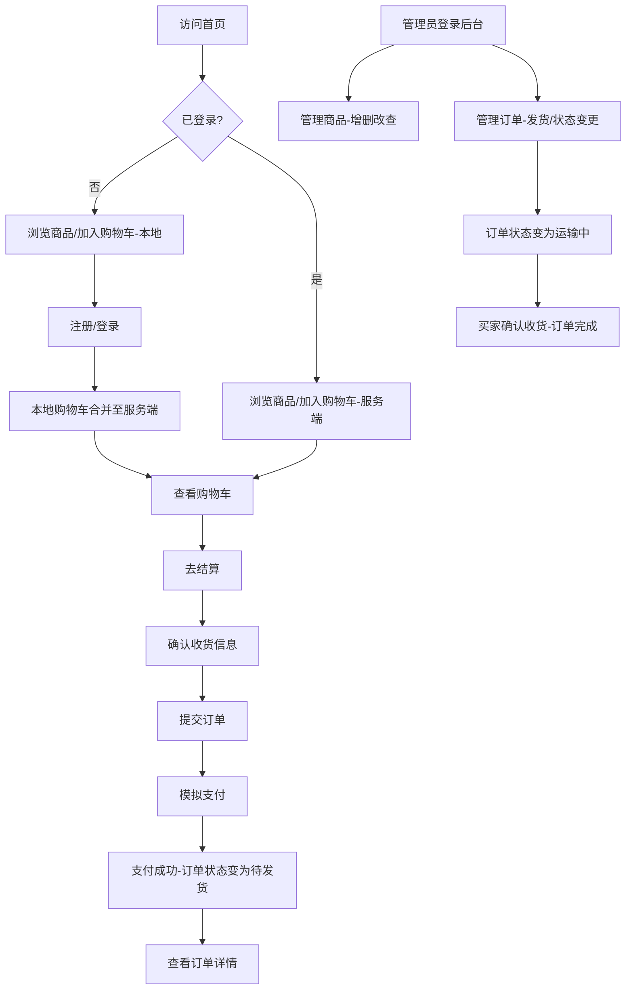

# Headless 电子商务系统 — 产品需求文档 (PRD)

## 1. 项目信息

| 项目 | 内容 |
|------|------|
| Language | 中文 |
| Programming Language | Next.js 15 + Spring Boot 3.x |
| Project Name | `headless-ecommerce` |
| 原始需求 | 开发一个 Headless（无头）电子商务系统，前端与后端完全解耦，通过 RESTful API 交互。MVP 聚焦核心电商闭环。 |

---

## 2. 产品定义

### 2.1 产品目标

1. **开箱即用的电商模板**：提供一套完整的前后端解耦电商系统模板，开发者可基于此快速定制任何品类的在线商城。
2. **极致的多端体验**：基于 Headless 架构，一套后端 API 驱动 PC Web、移动端 H5、智能终端等多种前端，实现一致的业务逻辑与数据。
3. **可扩展的技术底座**：MVP 验证核心闭环后，预留搜索（ES）、支付（Stripe/PayPal）、推荐等模块的扩展接口，支撑后续迭代。

### 2.2 用户故事

#### 买家角色

1. **作为买家**，我想要浏览商品列表并按分类筛选，以便快速找到感兴趣的商品。
2. **作为买家**，我想要查看商品详情（图片、价格、规格、库存），以便做出购买决策。
3. **作为买家**，我想要在未登录状态下添加商品到购物车，以便随时选购而不必先注册。
4. **作为买家**，我想要注册账号并登录，以便管理我的购物车、订单和个人信息。
5. **作为买家**，我想要完成下单并模拟支付，以便验证完整的购买流程。

#### 管理员角色

6. **作为管理员**，我想要管理商品（增删改查）和分类，以便维护商城的商品数据。
7. **作为管理员**，我想要查看和管理订单（状态流转），以便处理发货和售后。

---

## 3. 需求池

### P0 — 必须有（MVP 核心闭环）

| 编号 | 模块 | 需求 | 验收标准 |
|------|------|------|----------|
| P0-01 | 用户 | 注册（用户名+密码） | 注册成功返回 JWT，密码 BCrypt 加密存储 |
| P0-02 | 用户 | 登录 | 登录成功返回 JWT Token，支持 Token 刷新 |
| P0-03 | 商品 | 商品列表（分页） | 默认分页返回，支持按分类筛选 |
| P0-04 | 商品 | 商品详情 | 返回完整商品信息（名称、图片、价格、库存、描述） |
| P0-05 | 商品 | 分类列表 | 返回树形分类结构 |
| P0-06 | 购物车 | 未登录购物车（LocalStorage） | 前端本地维护购物车数据，页面刷新不丢失 |
| P0-07 | 购物车 | 登录后购物车同步（Redis） | 登录时本地购物车合并至服务端，后续操作走 Redis |
| P0-08 | 订单 | 创建订单 | 从购物车生成订单，扣减库存，返回订单号 |
| P0-09 | 订单 | 订单状态流转 | 待支付 → 待发货 → 运输中 → 已完成，状态机严格控制 |
| P0-10 | 支付 | 模拟支付 | 调用支付接口返回成功，订单状态自动流转至"待发货" |
| P0-11 | 商品(管理) | 管理员商品 CRUD | 管理员可新增/编辑/删除商品及分类 |
| P0-12 | 订单(管理) | 管理员订单管理 | 管理员可查看所有订单、修改订单状态（发货等） |

### P1 — 应该有（提升体验）

| 编号 | 模块 | 需求 | 说明 |
|------|------|------|------|
| P1-01 | 用户 | 用户信息管理 | 修改昵称、头像、收货地址 |
| P1-02 | 商品 | 商品搜索（MySQL LIKE） | 按商品名称模糊搜索，预留 ES 接口 |
| P1-03 | 商品 | 商品排序 | 按价格、销量、上架时间排序 |
| P1-04 | 订单 | 订单列表与详情 | 买家查看历史订单和订单详情 |
| P1-05 | 订单 | 取消订单 | 待支付状态下买家可取消订单，释放库存 |
| P1-06 | 购物车 | 购物车数量修改/删除 | 修改商品数量、移除商品 |
| P1-07 | 支付 | 支付接口预留 | 预留 Stripe/PayPal 真实对接接口（Strategy 模式） |

### P2 — 可以有（未来迭代）

| 编号 | 模块 | 需求 | 说明 |
|------|------|------|------|
| P2-01 | 搜索 | Elasticsearch 全文搜索 | 替换 MySQL LIKE，支持分词、高亮、聚合 |
| P2-02 | 支付 | Stripe/PayPal 真实对接 | 接入真实支付网关 |
| P2-03 | 商品 | 商品评价与评分 | 用户购买后可评价 |
| P2-04 | 商品 | SKU 多规格 | 支持颜色/尺码等多规格选择 |
| P2-05 | 用户 | 收藏与心愿单 | 收藏商品、心愿单管理 |
| P2-06 | 营销 | 优惠券系统 | 满减、折扣码等促销 |
| P2-07 | 通知 | 订单状态变更通知 | 邮件/短信通知 |
| P2-08 | 管理 | 管理后台数据看板 | 销售额、订单量等统计图表 |

---

## 4. UI 设计稿（文字描述）

### 4.1 前台页面

#### 首页
- **顶部**：Logo + 搜索栏 + 购物车图标（显示数量角标）+ 登录/注册按钮
- **Hero 区**：轮播 Banner（MVP 可静态图）
- **分类导航**：横向分类标签栏
- **商品推荐**：网格布局商品卡片（图片 + 名称 + 价格），2-4 列响应式
- **底部**：页脚信息

#### 商品列表页
- **左侧/顶部**：分类筛选 + 排序选项（默认/价格/最新）
- **主体**：商品卡片网格，支持分页加载
- **卡片内容**：商品图片、名称、价格、库存状态

#### 商品详情页
- **左侧**：商品大图 + 图片缩略图切换
- **右侧**：商品名称、价格、库存、描述、"加入购物车"按钮 + 数量选择器
- **下方**：商品详细描述/规格参数 Tab 面板

#### 购物车页
- **列表**：商品图片 + 名称 + 单价 + 数量调节器 + 小计 + 删除按钮
- **底部**：合计金额 + "去结算"按钮
- **空状态**：提示"购物车是空的"，引导去逛逛

#### 结算页
- **收货信息**：收货人、手机号、地址（MVP 可简化）
- **商品清单**：订单中的商品摘要
- **支付方式**：模拟支付按钮
- **底部**：订单总金额 + "提交订单"按钮

#### 订单确认页
- 订单号、订单状态、支付成功提示
- "查看订单详情"按钮、"继续购物"按钮

#### 用户中心
- **个人信息**：头像、昵称、修改入口
- **订单列表**：按状态 Tab 筛选（全部/待支付/待发货/运输中/已完成）
- **订单详情**：商品信息、金额、状态、物流跟踪占位

### 4.2 管理后台

#### 仪表盘
- 简化统计：今日订单数、总商品数、待发货订单数

#### 商品管理
- **列表**：商品表格（ID、名称、分类、价格、库存、操作）
- **新增/编辑**：表单（名称、分类、价格、库存、描述、图片上传）
- **分类管理**：分类列表 + 新增/编辑

#### 订单管理
- **列表**：订单表格（订单号、买家、金额、状态、操作）
- **详情**：订单完整信息 + 状态流转操作按钮

---

## 5. 核心用户流程

---

## 6. 待确认问题

| 编号 | 问题 | 影响范围 | 建议 |
|------|------|----------|------|
| Q-01 | 商品图片存储方案：本地文件系统 vs 云存储（OSS/S3）？ | 商品模块 | MVP 建议本地文件系统，后续迁移云存储 |
| Q-02 | 管理后台是否需要独立的鉴权体系（Admin 角色）还是复用用户表加 role 字段？ | 用户模块 | 建议用户表加 role 字段（ADMIN/BUYER），简化 MVP |
| Q-03 | 未登录购物车的本地数据与登录后服务端数据的合并策略？覆盖还是累加？ | 购物车模块 | 建议累加策略：相同商品数量取较大值 |
| Q-04 | 订单超时自动取消的时间阈值？ | 订单模块 | 建议 30 分钟未支付自动取消，释放库存 |
| Q-05 | 是否需要商品上下架功能？ | 商品模块 | 建议增加 status 字段（ON_SHELF/OFF_SHELF），管理员可控制 |
| Q-06 | 购物车中商品下架/库存不足时的处理策略？ | 购物车模块 | 建议标记为不可购买状态，提示用户移除 |
| Q-07 | 前端部署方式：Vercel / Docker / 自建服务器？ | 部署 | MVP 阶段建议 Docker Compose 一键部署 |
